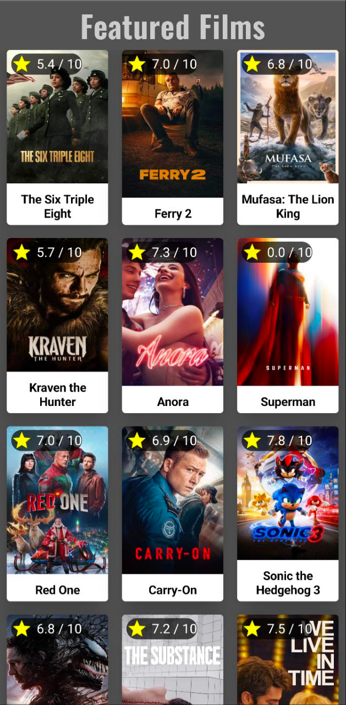
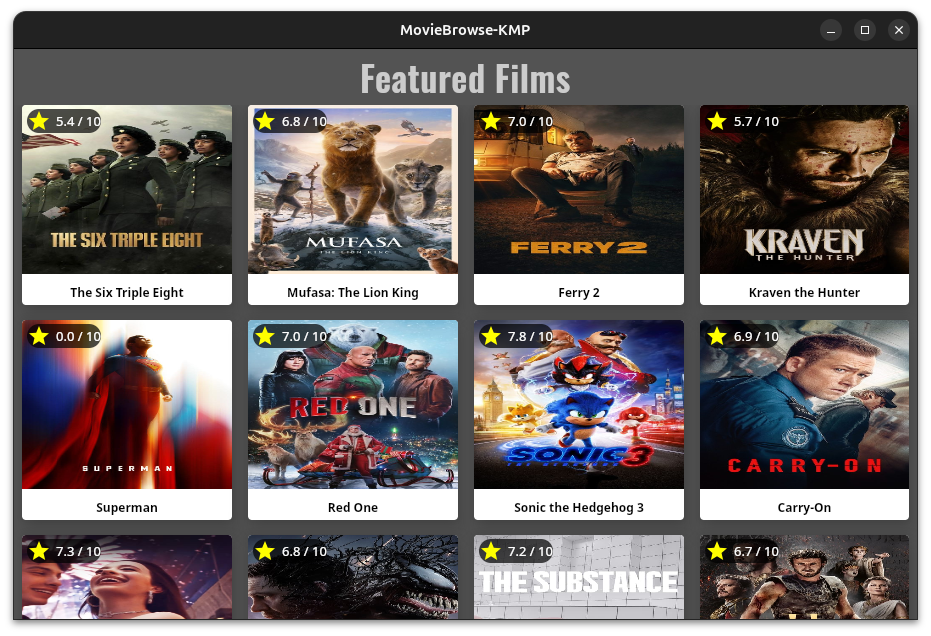
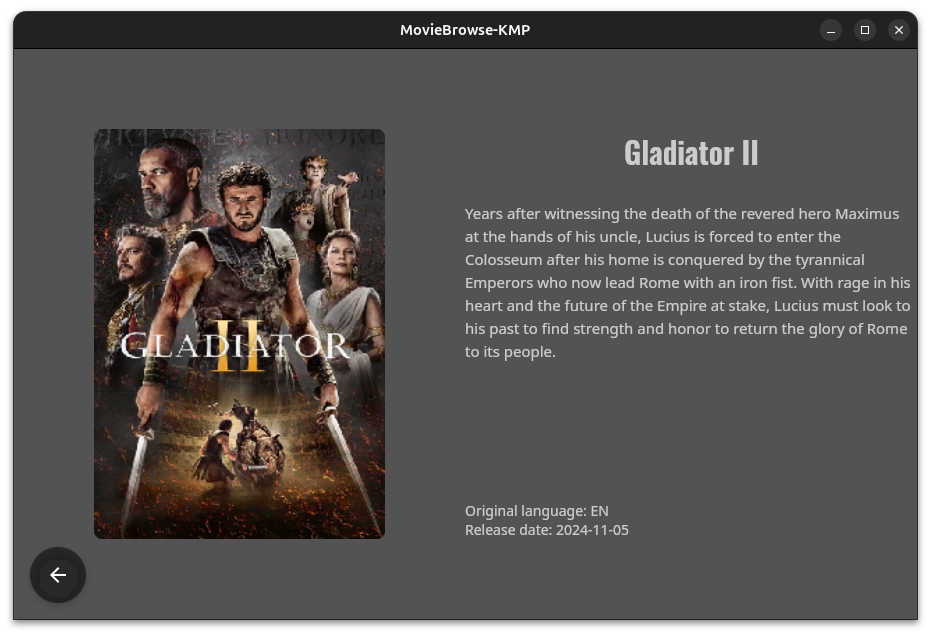

# MovieBrowse - KMP

## Description
A KMP application for browsing a list of films, that are popular right now.

## Targets
* **Android**
* **IOS**
* **Desktop**

## Libraries
* **Ktor-client** - sending requests to API
* **Coil** - showing an image based on the model's URL
* **Navigation-Compose** - changing components based on the current route
* **Koin** - dependency injection